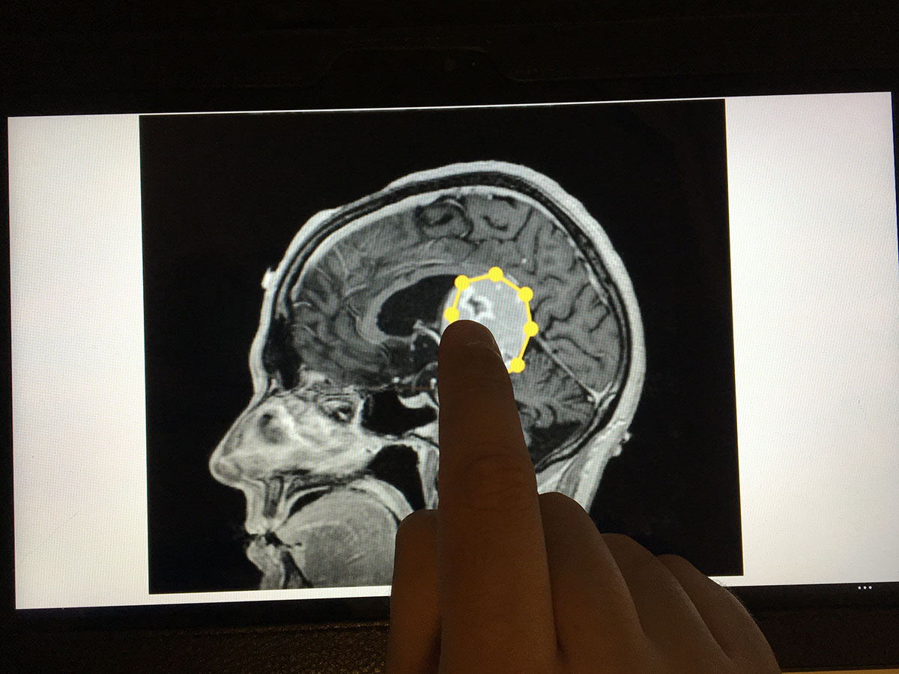

# ISS 2017 Poster

<a href="https://iss2017.acm.org/" title="ISS'17" target="_blank">
  
</a>

ACM Interactive Surfaces and Spaces ([ACM ISS 2017](https://iss2017.acm.org/)), formerly known as  the ACM International Conference on Interactive Tabletops and  Surfaces (ITS), welcomes original, high-quality research and industry  contributions that advance the state-of-the-art in the area of  interactive surfaces and spaces (including tabletops, large displays,  mobile, and mini devices). We embrace innovations in a wide variety of  areas including design, software, hardware, understanding of use, and  applications or deployments of interactive surfaces. The [paper](https://github.com/MIMBCD-UI/iss-2017-paper) was transfered from [Papers](https://github.com/MIMBCD-UI/iss-2017-paper) to [Posters](https://github.com/MIMBCD-UI/iss-2017-poster).

## Information

* [ISS 2017 Paper (Transfered to Posters)](https://github.com/MIMBCD-UI/iss-2017-paper) ([ShareLaTeX](https://www.sharelatex.com/project/593e6a22fd72fb464c1ec64d))
* [ISS 2017 Extended Abstract (Transfered from Papers)](https://github.com/MIMBCD-UI/iss-2017-poster/tree/master/src/extended-abstract) ([ShareLaTeX](https://www.sharelatex.com/project/59945aa2999c5e65ddf8099e))
* [ISS 2017 Poster (Transfered from Papers)](https://github.com/MIMBCD-UI/iss-2017-poster/tree/master/src/poster) ([ShareLaTeX](https://www.sharelatex.com/project/5994c40217353839f0ed39e6))
* [Prototype](http://ec2-52-14-244-33.us-east-2.compute.amazonaws.com/)
   * [Server 1](https://github.com/MIMBCD-UI/server-1)
   * [Server 2](https://github.com/MIMBCD-UI/server-2)
   * [Server 3](https://github.com/MIMBCD-UI/server-3)
* [Questionnairs](https://github.com/MIMBCD-UI/questionnaires)
   * [Traditional Prototype User Observation](https://github.com/MIMBCD-UI/questionnaires/tree/master/src/script_2)
   * [Touch Prototype User Observation](https://github.com/MIMBCD-UI/questionnaires/tree/master/src/script_3)
* [Brain User Testing Guide](https://github.com/MIMBCD-UI/testing-guide-brain)
* [SIGCHI Conference Publications Format](http://www.sigchi.org/publications/chipubform)

## TTBMIDA: Towards Touch-Based Medical Image Diagnosis Annotation



### Abstract

A fundamental step in medical diagnosis for patient follow-up relies on the ability of radiologists performing reliable diagnosis from acquired images. Basically, the diagnosis strongly depends on the visual inspection over the shape of the lesions, and somehow register its evolution through time. In existing clinical setups, a large number of images are currently acquired and should be individually inspected. As datasets increase in size, such visual evaluation becomes harder. For this reason it is crucial to introduce easy-to-use interfaces that help the radiologists not only to perform a reliable visual inspection but more importantly, allow the efficient delineation of the lesions. In this paper, we will present a study on integrating the above interfaces in a real-world scenario. More specifically, we will explore the radiologist's receptivity to the current touch environment solution. The advantages of touch are threefold: (i) the time performance is superior regarding the traditional use, (ii) it has more intuitive control and, (iii) for less time, the user interface delivers more information per action, concerning annotations. We concluded, from our studies that the path towards touch-based on medical image diagnosis annotation includes overcoming the current refusal to use these systems by radiologists, which resist change.  Also, a solution to the finger occlusion must be devised.

### Authors

[Francisco Maria Calisto](http://franciscocalisto.me/) ([FMCalisto](https://github.com/FMCalisto))

[Alfredo Ferreira](http://web.ist.utl.pt/alfredo.ferreira/)

[Daniel Gonçalves](http://web.ist.utl.pt/~daniel.j.goncalves/)

[Jacinto Nascimento](http://users.isr.ist.utl.pt/~jan/)

## Citing

We kindly ask **Scientific Research** and **Clinical Studies** that make use of [MIMBCD-UI](https://mimbcd-ui.github.io/) to cite [MIMBCD-UI](https://mimbcd-ui.github.io/) in their associated [publications](https://www.researchgate.net/project/MIMBCD-UI). Similarly, we ask **Open Source** and **Closed Source** products that make use of [MIMBCD-UI](https://mimbcd-ui.github.io/) to warn us about this use. You can cite this work using the following BibTeX entry:

```
@inproceedings{Calisto:2017:TTM:3132272.3134111,
 author = {Calisto, Francisco M. and Ferreira, Alfredo and Nascimento, Jacinto C. and Gon\c{c}alves, Daniel},
 title = {Towards Touch-Based Medical Image Diagnosis Annotation},
 booktitle = {Proceedings of the 2017 ACM International Conference on Interactive Surfaces and Spaces},
 series = {ISS '17},
 year = {2017},
 isbn = {978-1-4503-4691-7},
 location = {Brighton, United Kingdom},
 pages = {390--395},
 numpages = {6},
 url = {http://doi.acm.org/10.1145/3132272.3134111},
 doi = {10.1145/3132272.3134111},
 acmid = {3134111},
 publisher = {ACM},
 address = {New York, NY, USA},
 keywords = {Human-Computer Interaction, Interaction Design, Medical Image Diagnosis, Medical Visualization, Touch-Based},
} 
```

## Sponsors

<span class="image">
  <a href="http://www.fct.pt/" title="FCT" target="_blank">
    
  </a>
</span>
<span class="image">
  <a href="https://www.fccn.pt/en/" title="FCCN" target="_blank">
    
  </a>
</span>
<span class="image">
  <a href="https://www.ulisboa.pt/en/" title="ULisboa" target="_blank">
    
  </a>
</span>
<span class="image">
  <a href="http://tecnico.ulisboa.pt/" title="IST" target="_blank">
    
  </a>
</span>

## Departments

<span class="image">
  <a href="http://dei.tecnico.ulisboa.pt" title="DEI" target="_blank">
    
  </a>
</span>
<span class="image">
  <a href="http://deec.tecnico.ulisboa.pt" title="DEEC" target="_blank">
    
  </a>
</span>

## Laboratories

<span class="image">
  <a href="http://www.inesc-id.pt/" title="INESC-ID" target="_blank">
    
  </a>
</span>
<span class="image">
  <a href="http://welcome.isr.tecnico.ulisboa.pt/" title="ISR" target="_blank">
    
  </a>
</span>
<span class="image">
  <a href="http://welcome.isr.tecnico.ulisboa.pt/projects_cat/sipg/" title="SIGP" target="_blank">
    
  </a>
</span>
<span class="image">
  <a href="http://larsys.pt/" title="LARSys" target="_blank">
    
  </a>
</span>

## Countries

<span class="image">
  <a href="https://europa.eu/" title="EU" target="_blank">
    
  </a>
</span>
<span class="image">
  <a href="https://www.portugal.gov.pt/" title="Portugal" target="_blank">
    
  </a>
</span>
